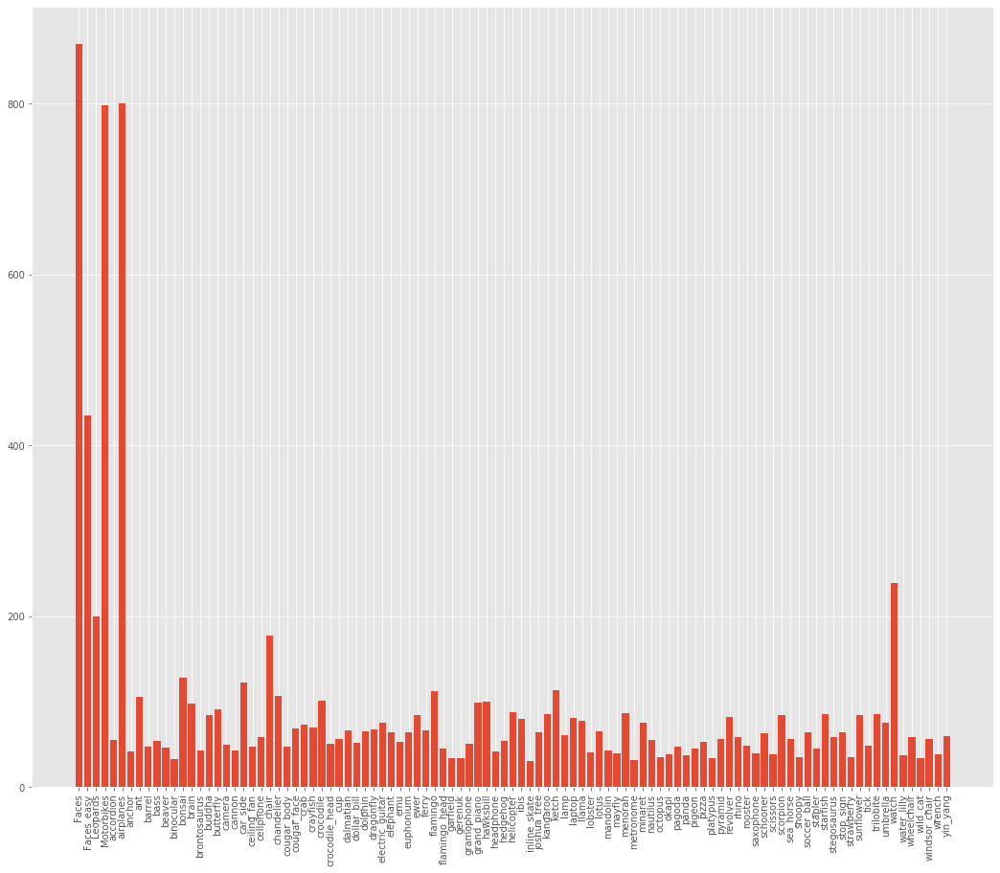

This repo shows my experiment on different image augmentation techniques.
A Heading in this SO entry!
## Dataset
For this experiment, I used the Caltech101.  
This dataset is small and highly imbalanced, so hopefully all the image augmentation techniques can show their effectiveness.

<em>Class distribution of Caltech10https://github.com/hoangloc0402/test_img_aug_tech1</em>

## Model
EfficientNet-B0 for classification

## Results

<table>
<thead>
  <tr>
    <th></th>
    <th>Technique</th>
    <th>Acc(%)</th>
  </tr>
</thead>
<tbody>
  <tr>
    <td colspan="2">No Augmentation</td>
    <td>54.76</td>
  </tr>
  <tr>
    <td rowspan="8">pyTorch</td>
    <td>Random Erasing</td>
    <td>56.95</td>
  </tr>
  <tr>
    <td>Vertical Flip</td>
    <td>59.37</td>
  </tr>
  <tr>
    <td>Horizontal Flip</td>
    <td>62.48</td>
  </tr>
  <tr>
    <td>Affine Transform</td>
    <td>65.42</td>
  </tr>
  <tr>
    <td>Rotation</td>
    <td>65.82</td>
  </tr>
  <tr>
    <td>Resized Crop</td>
    <td>68.13</td>
  </tr>
  <tr>
    <td>Resized Crop + Rotattion</td>
    <td>70.55</td>
  </tr>
  <tr>
    <td>Combination of all above</td>
    <td>65.42</td>
  </tr>
  <tr>
    <td rowspan="5">Not in pyTorch</td>
    <td>Cutout</td>
    <td>59.37</td>
  </tr>
  <tr>
    <td>RandAugment</td>
    <td>70.43</td>
  </tr>
  <tr>
    <td>AutoAugment</td>
    <td>65.30</td>
  </tr>
  <tr>
    <td>mixup</td>
    <td>57.69</td>
  </tr>
  <tr>
    <td>CutMix</td>
    <td>56.60</td>
  </tr>
</tbody>
</table>

## References:
<ul>
  <li><a href="https://pytorch.org/docs/stable/torchvision/transforms.html">pyTorch transformations</a></li>
  <li><a href="https://arxiv.org/abs/1708.04552">Cutout</a></li>
  <li><a href="https://arxiv.org/abs/1905.04899">Cutmix</a></li>
  <li><a href="https://arxiv.org/abs/1710.09412">mixup</a></li>
  <li><a href="https://arxiv.org/abs/1708.04896">RandomErasing</a></li>
  <li><a href="https://arxiv.org/abs/1805.09501">AutoAugment</a></li>
  <li><a href="https://arxiv.org/abs/1909.13719">RandAugment</a></li>
</ul>

and we can even [link](#head1234) to it so:

